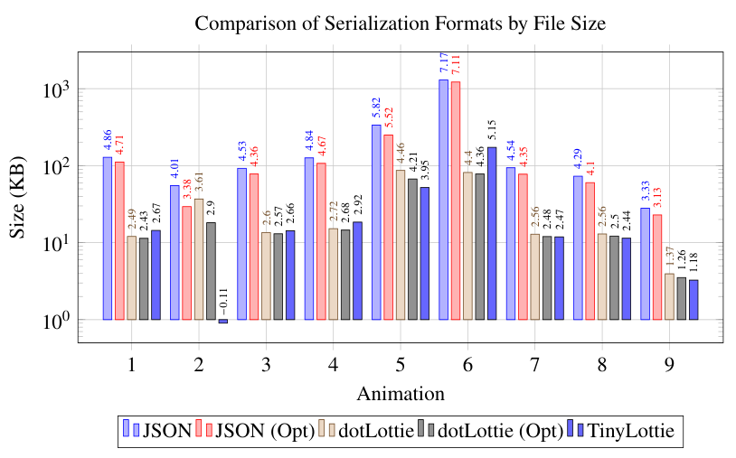
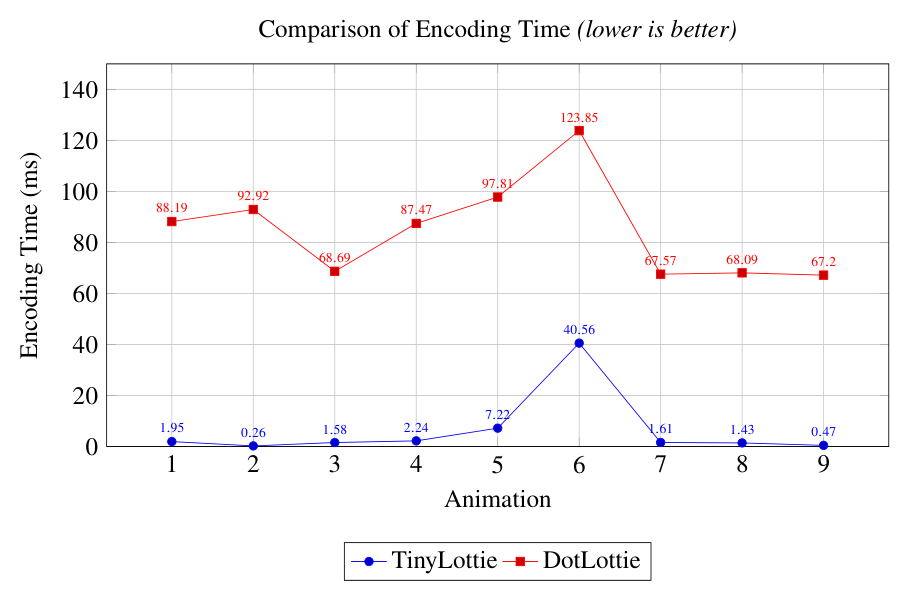
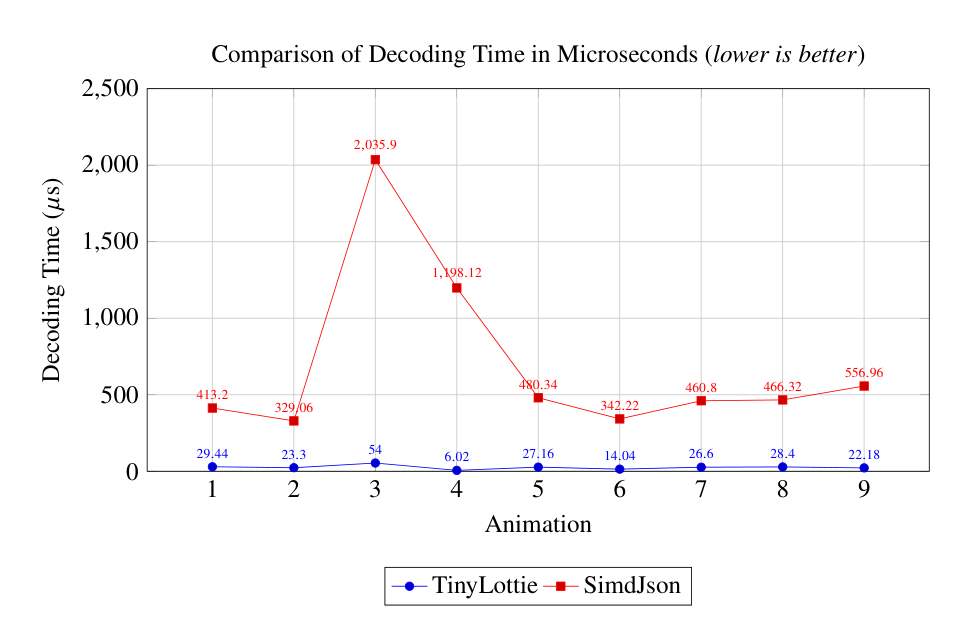

# The Tiny-Lottie Project

_**NOTE:**_ This project born out of of my thesis for my bachelors in computer science ad is very much still a work in progress. This readme is intented as a technical overview of the project.

Tiny-Lottie is a compact binary serialization format designed for Lottie animation data. Theoretically the reference encoder and decoder can run on any platform and is platform agnostic.
The current implementation of the format is still a prototype and very much far from being finished. In addition to that, the encoder/decoder will only able to handle a specific version of the Lottie specification and cannot handle other schemas at the moment.

In the future, it is a goal for the encoder and decoder to be generated through some codegen based on a version of JSON lottie schema. The format will also try not be too general enough to handle other JSON schemas as this might defeat the purpose of TinyLottie. More tools to explore the format such as debug and visualization tools will be developed. These tools will be able to visualize the different sections of the file allowing authors to find issues in the encoded files and be able to see how different sections of the encoded file map to the original JSON *(source-maps)*.

## Benchmarks
Below contains the benchmarks comparing tiny lottie against others. They measure size, decoder and encoding performance. These are taken from the thesis. For the size benchmark tiny lottie had still not implemented some more obvious optimizations for things such as asset packing and short string optimizations making the output more larger than it could be for some cases.






## Project Structure

- src/ - core library code, parser/mapper logic, types, and tests
- tools/ - sample applications, benchmarks, visualizer, and encoder CLI
- data/ - example Lottie JSON files, schema files, and helper scripts
- schema_validator/ - schema validation assets and related binaries

## Requirements

- Odin compiler installed and available on your PATH
- A supported shell for running the build scripts

## Building

### Windows

Run the batch build script:

```bat
build.bat
```

Useful targets include:

```bat
build.bat validator
build.bat sample_app
build.bat visualizer
build.bat encoder_cli
```

### Unix-like systems

Run the shell script:

```sh
./build.sh
```

Useful targets include:

```sh
./build.sh validator
./build.sh bench
./build.sh bench_decode
```

### Running tests

A test build can be produced with:

```sh
odin build src/ -build-mode:test -debug -define:ODIN_TEST_TRACK_MEMORY=false -define:ODIN_TEST_ALWAYS_REPORT_MEMORY=true -define:ODIN_TEST_FANCY=false -define:ODIN_TEST_NAMES=schema_json_parser_test
```
